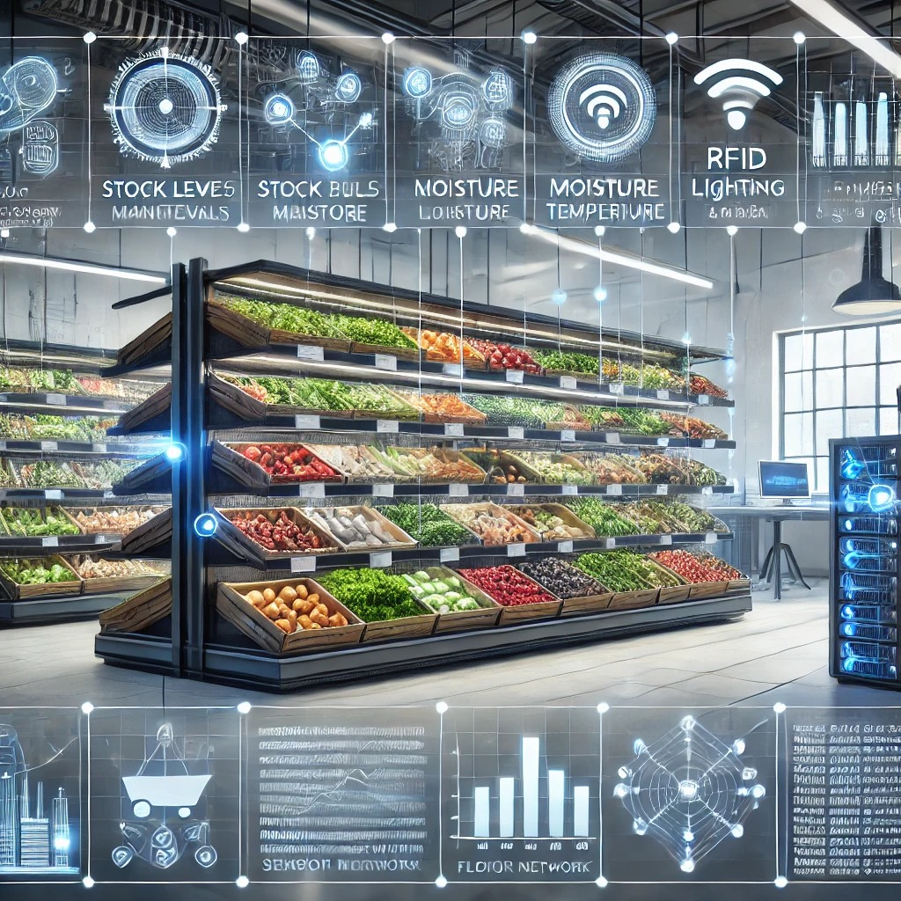

# Smart Produce Management System
# SmartShelf Innovators
## Team members:
- Maharashkumar Raval N01391355
- Ayushkumar Patel N01537221
- Winso Tuko N01544313
- Riyankumar Patel N01542237

### Project Description:
The Smart Produce Management System leverages sensors to monitor stock levels, moisture, lighting, and temperature in real-time, automating produce management to reduce waste and maintain freshness. It features NeoPixel LEDs for visual feedback, RFID for secure stockroom access, and an Android app for remote monitoring and control, enhancing efficiency and the customer experience.

### Github repo link: [SmartShelf Innovators](https://github.com/MaharshRaval1355/CENG322SoftwareProject.git)

